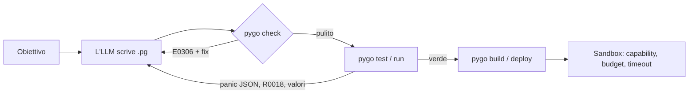
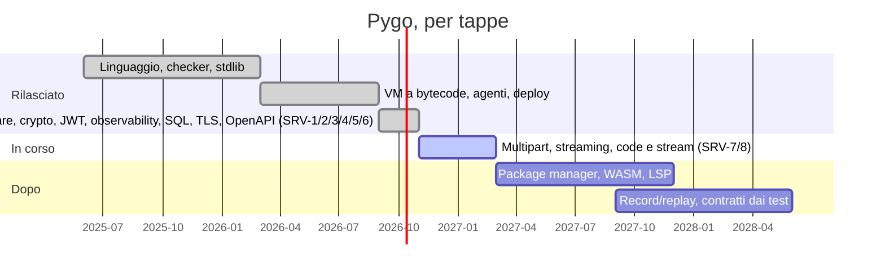

# Pygo — un linguaggio di programmazione progettato per le IA

Pygo è un linguaggio general-purpose, potente come Python o Go, pensato perché
lo **scriva, legga, corregga ed esegua un modello linguistico (LLM / agente)**.
La leggibilità per un essere umano non è un obiettivo: lo sono invece
l'affidabilità della generazione, la diagnostica leggibile da una macchina e
l'esecuzione sicura di codice generato automaticamente.

Il toolchain è un unico binario Go statico, senza dipendenze, che gira su Linux,
macOS, Windows, in Docker e in Kubernetes.

```
fn main() {
    let nums = [3, 1, 2]
    print("ordinati e raddoppiati: ${nums.map(fn(n) => n * 2).sorted()}")
}
```

## Perché è "per IA"

Ogni scelta di progetto risponde a un limite concreto degli LLM.

| Limite dell'LLM | Scelta di Pygo |
|---|---|
| Genera da sinistra a destra, senza tornare indietro | Grammatica senza ambiguità: blocchi `{}`, niente indentazione significativa, niente `;`, parentesi obbligatorie quando si mescolano `and`/`or` e `??`, confronti non concatenabili |
| Conosce bene solo la sintassi vista in addestramento | Solo le forme più comuni di Go, Rust, Python e TS (`fn`, `let`, `match`, `for x in`, `${}`); keyword brevi, ognuna 1 token |
| Più modi di scrivere la stessa cosa aumentano la varianza | Una sola forma canonica per ogni costrutto |
| Inventa API e nomi | Nomi, campi e metodi sconosciuti sono errori con suggerimento `did you mean` |
| Scambia l'ordine degli argomenti | Solo il primo argomento è posizionale: `transfer(10, from: a, to: b)` (errore `E0306` altrimenti) |
| Dimentica di gestire gli errori | `-> !T` indica una funzione che può fallire; chiamarla senza `try` o `catch` è un errore di compilazione (`E0401`) |
| Dimentica i `nil` | `nil` esiste solo nei tipi `T?`; usare un `T?` senza controllarlo è un errore (`E0310`), con narrowing su `if x != nil` |
| Codice generato = codice non fidato | Gli effetti sono capability (`uses fs, net`) verificate staticamente e a runtime; di default è tutto negato e si abilita con `--allow` |
| Costruisce HTML concatenando stringhe (XSS) | Il markup ha un tipo proprio, `Html`, che si scrive solo con `html"..."`: ogni `${x}` viene escapato secondo il contesto (testo, attributo, URL, script). Una `Str` non diventa mai `Html` (`E0301`, con correzione automatica) |
| Cicli infiniti e attese bloccanti durante i tentativi | `--max-steps` (budget deterministico) e `--timeout` (ferma anche i blocchi su canali/task); ricorsione troppo profonda → panico `R0018`, mai un crash |
| Lavora a cicli scrivi → esegui → correggi | Diagnostica JSON con codici stabili, hint e correzioni applicabili; panic in JSON con i valori delle variabili coinvolte; contratti `requires`/`ensures`; `test` inline |
| Errori non riproducibili | Mappe ordinate, `rand` con seme, orologio come effetto esplicito, overflow degli interi = errore |

Altre regole: niente shadowing, niente variabili globali mutabili, niente
conversioni implicite (`Int + Float` è un errore), niente "truthiness" (le
condizioni devono essere `Bool`), `match` esaustivo sugli enum.

## Confronto con gli altri linguaggi

Non è un benchmark: è una mappa di quanto un linguaggio aiuta un modello a
produrre codice **corretto e sicuro**. Pygo rinuncia all'ecosistema per
vincere sulla verificabilità e sul contenimento.


| Criterio (uso con un LLM) | Pygo | Python | Go | TypeScript | Rust |
|---|---|---|---|---|---|
| Impedisce gli errori tipici dell'LLM | ██████████ | ███░░░░░░░ | ██████░░░░ | █████░░░░░ | ████████░░ |
| Sandbox di codice non fidato | ██████████ | ██░░░░░░░░ | █████░░░░░ | ████░░░░░░ | ███████░░░ |
| Determinismo / riproducibilità | █████████░ | █████░░░░░ | ██████░░░░ | ██████░░░░ | ███████░░░ |
| Diagnostica JSON per agenti | ██████████ | ████░░░░░░ | ████░░░░░░ | █████░░░░░ | ████░░░░░░ |
| Ecosistema e librerie | ███░░░░░░░ | ██████████ | ████████░░ | ██████████ | ███████░░░ |
| Performance a runtime | █████░░░░░ | ███░░░░░░░ | █████████░ | ███████░░░ | ██████████ |
| Presenza nei dati di addestramento | █░░░░░░░░░ | ██████████ | ████████░░ | █████████░ | ███████░░░ |

> Scala qualitativa 0–10, non un benchmark. Python e TypeScript vincono
> sull'ecosistema; Pygo vince su ciò che serve **dopo** che il codice è stato
> generato: verificarlo ed eseguirlo senza rischi. Pygo è una VM a bytecode
> senza JIT: più lenta di Go e Rust, e per questo il punteggio di performance
> resta onestamente basso.

## Come migliora la programmazione con l'IA

Un LLM procede per tentativi. Pygo rende ogni tentativo verificabile da una
macchina: il ciclo diventa esplicito e il modello riceve errori strutturati,
non prosa da interpretare.



| Cosa sbagliano gli LLM | Cosa fa Pygo | Codice / comando |
|---|---|---|
| Sintassi non valida | Grammatica senza ambiguità, una sola forma canonica | `pygo fmt`, `pygo grammar` (roadmap) |
| API inventate | Firme stdlib tipizzate e suggerimento `did you mean` | `pygo check --json` |
| Argomenti invertiti | Solo il primo argomento è posizionale | `E0306` |
| Errori e `nil` dimenticati | `-> !T`, `T?` e narrowing obbligatori | `E0401`, `E0310` |
| Loop e attese infinite | Budget di passi, timeout, ricorsione limitata | `--max-steps`, `--timeout`, `R0018` |
| Codice generato non fidato | Capability negate di default, sandbox Kubernetes | `--allow`, `job-sandbox.yaml` |
| Risultati non riproducibili | Mappe ordinate, `rand` con seme, orologio-effetto, overflow = errore | — |
| Correzione manuale | Diagnostiche JSON con hint e correzione applicabile | `pygo fix` |

Il piano completo — constrained decoding dalla grammatica, contesto a budget,
record/replay degli effetti, contratti generati dai test — è in
[`docs/ROADMAP_AI.md`](docs/ROADMAP_AI.md).

## Esempio

```
import "json"

struct Line { sku: Str, qty: Int, price: Float }

enum Outcome {
    Accepted(total: Float)
    Rejected(reason: Str)
}

fn line_total(l: Line) -> !Float
    requires l.price >= 0.0
{
    if l.qty <= 0 {
        fail error("invalid quantity", code: "E_QTY", data: l.qty)
    }
    return float(l.qty) * l.price
}

fn evaluate(text: Str) -> Outcome {
    let l = json.decode_as(text, schema: Line) catch e {
        return Outcome.Rejected(reason: e.message)
    }
    let total = line_total(l) catch e { return Outcome.Rejected(reason: e.code) }
    return Outcome.Accepted(total: total)
}

test "rejects zero quantity" {
    let rejected = match evaluate(r"""{"sku": "X", "qty": 0, "price": 1.0}""") {
        Outcome.Rejected(_) => true
        _ => false
    }
    assert rejected
}
```

Altri esempi sono in [`examples/`](examples/).

## Installazione

Scarica il binario per il tuo sistema dalla release
**[v0.2.0](https://github.com/marcodc74/pygo/releases/tag/v0.2.0)**.
Non ha dipendenze: basta un file.

| Sistema | File |
|---|---|
| Linux x86-64 | [`pygo-linux-amd64`](https://github.com/marcodc74/pygo/releases/download/v0.2.0/pygo-linux-amd64) |
| Linux ARM64 | [`pygo-linux-arm64`](https://github.com/marcodc74/pygo/releases/download/v0.2.0/pygo-linux-arm64) |
| macOS Intel | [`pygo-darwin-amd64`](https://github.com/marcodc74/pygo/releases/download/v0.2.0/pygo-darwin-amd64) |
| macOS Apple Silicon | [`pygo-darwin-arm64`](https://github.com/marcodc74/pygo/releases/download/v0.2.0/pygo-darwin-arm64) |
| Windows x86-64 | [`pygo-windows-amd64.exe`](https://github.com/marcodc74/pygo/releases/download/v0.2.0/pygo-windows-amd64.exe) |
| Windows ARM64 | [`pygo-windows-arm64.exe`](https://github.com/marcodc74/pygo/releases/download/v0.2.0/pygo-windows-arm64.exe) |

Esempio su Linux x86-64:

```sh
curl -fsSLO https://github.com/marcodc74/pygo/releases/download/v0.2.0/pygo-linux-amd64
curl -fsSLO https://github.com/marcodc74/pygo/releases/download/v0.2.0/SHA256SUMS
sha256sum -c --ignore-missing SHA256SUMS     # verifica l'integrità
chmod +x pygo-linux-amd64 && sudo mv pygo-linux-amd64 /usr/local/bin/pygo
pygo version
```

Su macOS il binario scaricato dal browser può essere bloccato da Gatekeeper; si sblocca con
`xattr -d com.apple.quarantine pygo-darwin-arm64`.

### Windows

Il modo più semplice è lo script di installazione. Apri **PowerShell** e incolla:

```powershell
irm https://raw.githubusercontent.com/marcodc74/pygo/master/install.ps1 | iex
```

Lo script ([`install.ps1`](install.ps1)):
- sceglie il binario giusto per il tuo PC (x64 o ARM64) e lo scarica dalla release;
- verifica che il file sia integro confrontandolo con `SHA256SUMS`, e si ferma se non coincide;
- lo installa in `%LOCALAPPDATA%\Programs\pygo\pygo.exe` e aggiunge la cartella al PATH dell'utente.

Non servono diritti di amministratore. Per una versione precisa, prima di lanciarlo imposta
`$env:PYGO_VERSION = "v0.2.0"`; per un'altra cartella, `$env:PYGO_DIR = "C:\tools\pygo"`.
Dopo l'installazione apri un nuovo terminale e prova `pygo version`.

**Avvisi di sicurezza.** Per ora i binari di Pygo non hanno una firma digitale (Authenticode),
quindi Windows può mostrare degli avvisi quando li scarichi dal browser. Non significa che il file
sia dannoso: puoi sempre verificarne l'integrità con `SHA256SUMS`. L'installazione con lo script
evita di solito questi blocchi.
- **"Windows ha protetto il PC" (SmartScreen):** clicca *Ulteriori informazioni* → *Esegui comunque*.
  In alternativa, da PowerShell: `Unblock-File .\pygo-windows-amd64.exe`.
- **Microsoft Defender mette il file in quarantena:** è un falso positivo frequente per i programmi
  compilati con Go. Ripristinalo da *Sicurezza di Windows → Protezione da virus e minacce →
  Cronologia protezione*, e se vuoi segnalalo a Microsoft come falso positivo.
- **Senza scaricare eseguibili:** se hai Go installato, `go install github.com/marcodc74/pygo/cmd/pygo@v0.2.0`
  compila pygo sul tuo PC e di solito non attiva SmartScreen.

La firma digitale dei binari Windows è in programma: eliminerà la maggior parte di questi avvisi.

Installazione manuale: scarica il file `.exe` dalla tabella sopra e rinominalo in `pygo.exe`.

Tutte le versioni sono elencate in [Releases](https://github.com/marcodc74/pygo/releases).
In alternativa puoi compilare dai sorgenti (serve Go >= 1.22):
`go build -o pygo ./cmd/pygo`.

## Uso

```sh
./pygo run examples/hello.pg
./pygo run --allow fs,net app.pg -- arg1 arg2
./pygo run -e 'print([1, 2, 3].map(fn(x) => x * x).sum())'
./pygo compile -o app.pgc app.pg     # compila in bytecode (.pgc)
./pygo run app.pgc                   # esegue il bytecode senza ricompilare
./pygo disasm --fn main app.pg       # mostra il bytecode di una funzione
./pygo check --json app.pg           # diagnostica per agenti
./pygo test examples/                # esegue i blocchi test "..." {}
```

Comandi pensati per un agente (tutti con output JSON):

| Comando | A cosa serve |
|---|---|
| `pygo guide` | Specifica compatta del linguaggio e firme della stdlib (~3.100 token), da mettere nel contesto del modello |
| `pygo check --json` | Diagnostica con codice stabile, hint e correzione applicabile (`fix`) |
| `pygo fix [--all]` | Applica le correzioni: sicure di default, anche i "did you mean" con `--all` |
| `pygo explain E0306` | Spiega un codice con esempio sbagliato e corretto |
| `pygo describe file.pg\|json` | API di un file o di un modulo stdlib in JSON |
| `pygo outline file.pg` | Simboli (`fn:main`, `struct:User`, ...) con righe e hash del contenuto |
| `pygo edit file.pg --replace fn:nome` | Sostituisce, inserisce o cancella una dichiarazione intera (niente diff per riga); `--expect-hash` rifiuta la modifica se nel frattempo il simbolo è cambiato |
| `pygo fmt [-w]` | Forma canonica unica |
| `pygo ast file.pg` | AST in JSON |
| `pygo build -o app file.pg` | Eseguibile autonomo (runtime + bytecode); con `--runtime` si può usare un binario compilato per un altro OS |
| `pygo compile -o app.pgc file.pg` | Controlla e compila in bytecode; `pygo run app.pgc` lo esegue senza ricompilare |
| `pygo disasm [--json] [--fn nome]` | Mostra il bytecode di un `.pg` o `.pgc`, con posizione nel sorgente di ogni istruzione |
| `pygo extern python MODULE` | Genera le dichiarazioni `extern` di una libreria Python dalle sue firme reali |

Exit code stabili: `0` ok, `1` failure non gestita in `main`, `2` panic,
`3` errore di compilazione, `4` capability non concessa.

Esempio di diagnostica (`pygo check --json`):

```json
{
  "code": "E0306",
  "severity": "error",
  "message": "argument 2 of transfer must be named (only the first argument is positional)",
  "file": "bad.pg", "line": 5, "col": 18,
  "hint": "write from: \"alice\""
}
```

## Il linguaggio in breve

- **Tipi**: `Int` (64 bit, con controllo dell'overflow), `Float`, `Str`, `Bool`,
  `Html` (markup sicuro), `List[T]`, `Map[K, V]` (ordinata), `T?`, `fn(A) -> !B`, `Chan[T]`, `Task[T]`,
  `Error`, `Any`, più `struct`, `enum` con payload, `impl` con metodi e funzioni
  generiche `fn first[T](xs: List[T]) -> T?`.
- **Variabili**: `let` (immutabile) e `var` (mutabile).
- **Errori**: `fail error("msg", code: "E_X")`, `try f()` propaga l'errore,
  `f() catch e { ... }` lo gestisce. I bug veri (indice fuori range, assert,
  contratti violati) sono panic non catturabili.
- **Concorrenza**: `spawn f(x)` restituisce un `Task`, poi `try t.wait()` o
  `wait_all(tasks)`; `chan(n)` con `send`, `recv`, `close` e `for v in ch`.
- **Stringhe**: `"ciao ${nome}"`, `"${x:.2}"`, `"${n:>5}"`; `r"..."` e
  `"""..."""` per il testo raw o su più righe. `{` e `}` sono caratteri normali,
  quindi il JSON dentro una stringa non va escapato.
- **HTML**: `html"<li class='${stato}'>${titolo}</li>"` è di tipo `Html` e
  escapa ogni valore secondo il contesto. `Html` e `List[Html]` si inseriscono
  così come sono, per comporre le pagine; `http.html(200, body: pagina)`
  risponde con `text/html`. Il checker segnala i frammenti malformati (`E0312`)
  e i valori non ammessi (`E0311`). `html.raw(s)` è l'unica via per usare
  markup senza escaping ed è pensata per markup scritto dal programma stesso.
- **Server web**: `http.dispatch(req, routes: [...])` sceglie la prima
  `http.Route{method: "GET", path: "/items/{id}", handler: f}` che corrisponde
  (parametri in `req.params`, 405 e 404 automatici); `http.static` serve i
  file del frontend con il content-type giusto, senza file nascosti né `..`;
  `http.form`, `http.redirect`, cookie con default sicuri (`HttpOnly`,
  `Secure`, `SameSite=Lax`) e un limite alla dimensione del body (413).
- **Middleware**: `http.dispatch(req, routes: routes(), middleware: [http.request_id(), http.log_requests(), http.recover()])`.
  Un middleware è `http.Middleware{name, apply}` (prende l'handler successivo e
  restituisce quello da eseguire); girano da sinistra a destra, possono
  rispondere senza chiamare `next` e avvolgono anche 404/405. Pronti:
  `request_id` (echo di `x-request-id`, riproducibile), `log_requests` (una
  riga JSON per richiesta), `recover` (panic → 500) e `timeout(ms)` (→ 503).
  Vedi [`examples/middleware.pg`](examples/middleware.pg).
- **Libreria standard**: `json`, `fs`, `os`, `http` (client e server con
  shutdown graceful e routing), `html`, `time`, `log` (JSON su stderr), `math`, `re`, `proc`,
  `rand`, `crypto` (hash, HMAC, PBKDF2, confronto a tempo costante) e `jwt`
  (HS256). Le firme sono in [`internal/sig/std/`](internal/sig/std/), scritte in
  Pygo stesso: sono l'unica fonte di verità per checker, runtime e documentazione.

## Librerie Python

Pygo può usare qualunque libreria Python (stdlib, numpy, pandas, requests…). Dichiari
**esattamente** cosa usi, con i tipi, e il checker controlla le chiamate come per la stdlib:
il modello non può inventare funzioni o sbagliare l'ordine degli argomenti.

```
extern python "statistics" {
    fn mean(data: List[Float]) -> !Float
}

extern python "collections" {
    type Counter {                                   // oggetto che resta in Python
        fn most_common(self, n: Int? = nil) -> !List[List[Any]]
    }
    fn Counter(items: List[Str]) -> !Counter
}

fn main() -> ! uses python {
    print(try statistics.mean([2.0, 4.0, 9.0]))
    let c = try collections.Counter(["a", "b", "a"])
    print(try c.most_common(n: 1))
}
```

```sh
pygo run --allow python app.pg                      # Python non gira senza questo permesso
pygo extern python statistics mean stdev            # genera le dichiarazioni dalle firme Python
```

- **Fallibilità:** ogni funzione Python è fallibile (`-> !T`). Le eccezioni diventano errori
  gestibili con `try`/`catch`: `E_PYTHON` riporta il traceback, mentre `E_PYTHON_IMPORT`
  suggerisce il `pip install` da fare.
- **Controllo dei risultati:** i valori restituiti vengono verificati contro i tipi dichiarati
  (`E_PYTHON_TYPE`). Gli oggetti complessi restano in Python come *handle* con i loro metodi.
- **Esecuzione:** Python gira in un processo separato. Serve Python 3 installato (`--python`
  o `PYGO_PYTHON` per sceglierlo), oppure l'immagine Docker `app-python`.
- **Sicurezza:** concedere `python` equivale a concedere tutto, perché Python può usare file e
  rete. Inoltre il budget di passi non copre il codice Python, mentre `--timeout` sì.

Esempio completo: [`examples/python_stats.pg`](examples/python_stats.pg). Dettagli in `docs/SPEC.md` §14.1.

## Deploy: ogni sistema operativo, Docker, Kubernetes

```sh
make dist        # binari statici in dist/: linux, darwin, windows × amd64, arm64
./pygo build --allow net,env -o server examples/server.pg      # un solo eseguibile autonomo
./pygo build --runtime dist/pygo-windows-amd64.exe -o app.exe app.pg   # build per un altro OS

docker build -f deploy/Dockerfile -t pygo-app .                    # immagine dell'app (16 MB, distroless, non-root)
docker build -f deploy/Dockerfile --build-arg APP=mio.pg --build-arg ALLOW=net -t mia-app .
docker build -f deploy/Dockerfile --target toolchain -t pygo .     # immagine con la CLI
docker build -f deploy/Dockerfile --target app-python --build-arg APP=app.pg --build-arg ALLOW=python -t app .   # con Python

kubectl apply -f deploy/k8s/deployment.yaml     # Deployment + Service, probe su /healthz
```

- **Build dell'immagine:** la build Docker esegue `check` e `test` sul programma. Un programma che non passa i controlli non diventa un'immagine.
- **Shutdown:** `http.serve` chiude le connessioni in modo pulito su SIGTERM, come serve per i rolling update di Kubernetes.
- **Log:** `log.info(...)` scrive una riga JSON su stderr, pronta per i raccoglitori di log.
- **Sandbox per codice generato da IA:** `deploy/k8s/job-sandbox.yaml` esegue il programma
  - senza capability Pygo;
  - con budget di passi e timeout;
  - con filesystem in sola lettura;
  - con una NetworkPolicy che blocca tutto il traffico.

  Un ciclo infinito termina con un report JSON (`R0011`) e l'accesso a file o rete senza permesso termina con exit 4.

## Usarlo con gli LLM

La guida [`docs/LLM.md`](docs/LLM.md) spiega come far scrivere Pygo ai modelli principali.

- **Chat** (ChatGPT, Claude.ai, Gemini): incolli `pygo guide` nelle istruzioni.
- **CLI di coding:** Claude Code, OpenAI Codex CLI, Gemini CLI, opencode, GitHub Copilot, Cursor, Qwen Code e Aider. Ci sono un `AGENTS.md` pronto e una skill per Claude Code.
- **API:** Claude, OpenAI, Gemini e modelli locali (Ollama, vLLM, llama.cpp). C'è un agente pronto:

```sh
cp integrations/AGENTS.md ./AGENTS.md          # istruzioni per qualunque CLI di coding
python integrations/agent.py --provider claude "scrivi un programma Pygo che ..."
```

## Documentazione

- [`README_AI.md`](README_AI.md): pagina di orientamento per un LLM che scrive o esegue Pygo (il ciclo check→test→run, i comandi, la sicurezza, esempi).
- [`docs/LLM.md`](docs/LLM.md): come usare Pygo con i vari LLM, dalle chat alle CLI alle API.
- [`docs/ROADMAP_AI.md`](docs/ROADMAP_AI.md): il piano per un linguaggio AI-native (milestone, ROI, criteri di accettazione).
- [`docs/SPEC.md`](docs/SPEC.md): specifica completa del linguaggio.
- [`docs/BYTECODE.md`](docs/BYTECODE.md): la macchina virtuale, le istruzioni e il formato `.pgc`.
- [`docs/GUIDE.md`](docs/GUIDE.md): guida compatta da mettere nel contesto di un modello (`pygo guide`).
- `pygo explain` spiega tutti i codici diagnostici (E/W) e runtime (R).

Le due guide sono in inglese: costano meno token e sono la lingua più rappresentata nei dati di addestramento dei modelli.

## Architettura

```
cmd/pygo/           CLI
internal/lexer      token, terminatori automatici, interpolazione ${...}
internal/parser     parser a discesa ricorsiva con recupero dagli errori
internal/ast        AST, visitor, export JSON
internal/sig        firme della stdlib (file .pg incorporati nel binario)
internal/check      checker statico: nomi, tipi, fallibilità, effetti, nil, esaustività, correzioni
internal/safehtml   compilazione dei letterali html"..." con l'escaping di html/template
internal/interp     runtime: valori thread-safe, stdlib, goroutine per spawn/chan;
                    la VM a bytecode (vm_compile.go compila, vm.go esegue,
                    pgc.go è il formato .pgc, disasm.go il disassemblatore)
                    e l'interprete ad albero
bench/              programmi di benchmark per confrontare i motori
integrations/       AGENTS.md, skill per Claude Code, tool per le API degli LLM (pygo_tools.py, agent.py)
internal/printer    stampa canonica dell'AST (pygo fmt)
internal/loader     moduli locali (import "./x"), cicli, bundle
internal/guide      guida compatta per il contesto dei modelli
deploy/             Dockerfile, manifest Kubernetes
examples/           hello, errors, concurrency, server (HTTP), middleware (HTTP), wordcount (CLI su file)
```

## Stato

v0.2.

**Fatto e testato:**
- **Linguaggio e checker:** linguaggio completo, checker statico, interprete, stdlib e concorrenza.
- **Librerie Python** (`extern python`): chiamate tipizzate, handle, errori, capability `python`,
  generatore di dichiarazioni; test su Python reale.
- **Strumenti per agenti:** tutti i comandi della CLI elencati sopra.
- **Distribuzione:** cross-compilazione per 6 piattaforme.
- **Docker:** immagini costruite e provate (l'app risponde, lo shutdown è pulito, la sandbox blocca cicli infiniti e permessi mancanti).
- **Kubernetes:** i manifest sono sintatticamente validi, ma non li ho applicati a un cluster reale.
- **VM a bytecode**, motore predefinito. Compilatore e macchina virtuale propri di Pygo,
  da 1,2 a 3,5 volte più veloce dell'interprete ad albero (`--engine tree`). Le chiamate compilate
  riusano buffer e frame per thread e il binding dei metodi: su `fib` le allocazioni scendono da
  ~1,27M a ~0,64M e su merge-sort da ~2,09M a ~0,82M (memoria −40% e −60%). Si può compilare in
  un file `.pgc` (`pygo compile`) che `run` e `test` eseguono direttamente, e che `pygo build` include
  negli eseguibili. Ogni programma di test gira in tre modi (interprete, VM, VM da `.pgc`), che
  devono dare output, errori, trace e numero di passi identici. Dettagli in
  [`docs/BYTECODE.md`](docs/BYTECODE.md).
- **Servizi di produzione (M7):** middleware componibile (`request_id`, `log_requests`, `recover`, `timeout` con `R0019`); observability (`/metrics` in formato Prometheus, istogramma di latenza, gauge in-flight, sonde `/healthz` e `/readyz`, span OTLP/HTTP con `http.tracing`); auth senza dipendenze (`crypto`: SHA-256, HMAC, PBKDF2, confronto a tempo costante; `jwt` HS256); accesso a PostgreSQL senza driver né CGO (`sql`: query tipizzate e decodifica con `query_as`, parametri `$1`/`?` fuori dal testo SQL, autenticazione SCRAM-SHA-256); HTTPS con ricarica del certificato a caldo (`http.serve` con `tls: http.Tls`, TLS 1.2+, HTTP/2); specifica OpenAPI 3.1 generata dalle route (`http.openapi`, schemi JSON da struct ed enum, servibile su `/openapi.json`).
- **Integrazione con gli LLM** ([`docs/LLM.md`](docs/LLM.md)):
  - `AGENTS.md` e una skill per Claude Code;
  - tool e agente per le API di Claude, OpenAI, Gemini e modelli locali. Li ho provati con gli SDK reali e risposte simulate, non contro le API vere.
- **Test:** unit test, test golden sugli esempi e race detector passano.
- **CI:** GitHub Actions su Linux, macOS e Windows, con build dei binari e smoke test Docker.

## Roadmap



- **Prossimo — servizi di produzione (M7):** multipart/streaming (`SRV-7`), code e stream (`SRV-8`). Dettagli e criteri di accettazione in [`docs/ROADMAP_AI.md`](docs/ROADMAP_AI.md).
- **Piattaforma:** firma Authenticode dei binari Windows, backend WebAssembly, LSP, package manager, `select` su più canali, effetti per le funzioni di ordine superiore, conservare i commenti in `fmt`, trait e interfacce.
- **Verso l'IA nativa (M1–M6):** constrained decoding dalla grammatica, contesto selezionato a budget, record/replay degli effetti, contratti generati dagli esempi, correzione con prove (property test e fuzzing).

## Sviluppo

```sh
make test     # vet + gofmt + unit test + test degli esempi
make race     # race detector
make integrations  # autotest dei tool per gli LLM (serve python3)
make dist     # cross-compilazione
```
